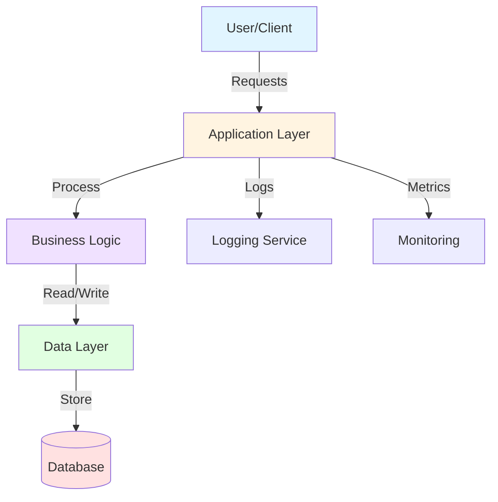
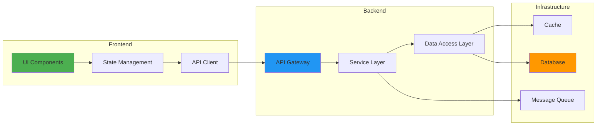
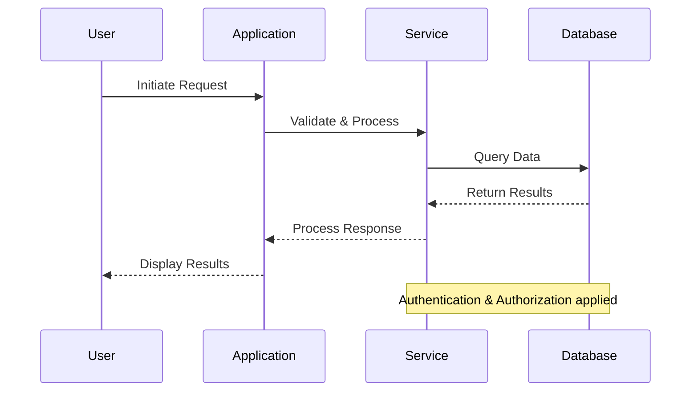
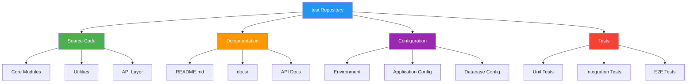
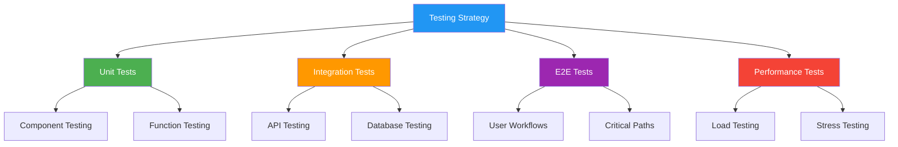
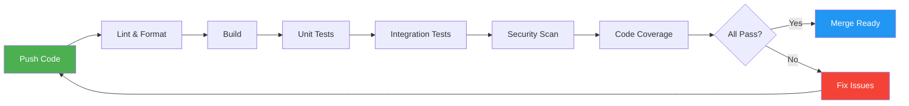
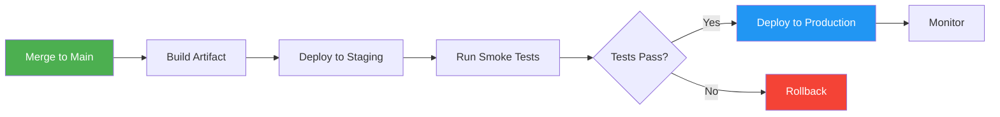
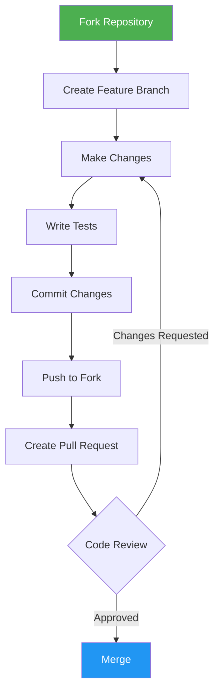

# Test Repository

[](LICENSE)
[](https://github.com/messier-kevin-cgi/test/issues)
[](https://github.com/messier-kevin-cgi/test/stargazers)

## 📋 Table of Contents

- [Overview](#overview)
- [Architecture](#architecture)
- [Features](#features)
- [Getting Started](#getting-started)
  - [Prerequisites](#prerequisites)
  - [Installation](#installation)
  - [Configuration](#configuration)
- [Usage](#usage)
- [Project Structure](#project-structure)
- [Development](#development)
  - [Local Setup](#local-setup)
  - [Testing](#testing)
  - [Code Quality](#code-quality)
- [CI/CD](#cicd)
- [Contributing](#contributing)
- [Security](#security)
- [License](#license)
- [Contact](#contact)

## 🎯 Overview

This is a test repository for demonstrating best practices in documentation, project structure, and development workflows.

> ⚠️ **Note**: This repository currently contains minimal code. The information below represents a template for best practices when the project expands.

### Key Objectives

- Demonstrate comprehensive documentation standards
- Showcase modern development workflows
- Provide a template for future projects
- Illustrate CI/CD integration patterns

## 🏗️ Architecture

### High-Level Architecture



### Component Architecture



### Data Flow



## ✨ Features

> ⚠️ **Missing Information**: Feature list to be populated as project develops.

### Planned Features

- [ ] Core functionality implementation
- [ ] API endpoints
- [ ] Database integration
- [ ] Authentication system
- [ ] Admin dashboard
- [ ] Automated testing suite
- [ ] Documentation site

## 🚀 Getting Started

### Prerequisites

> ⚠️ **Missing Information**: Technology stack not yet defined. Common prerequisites listed below:

- **Programming Language**: TBD (e.g., Python 3.9+, Node.js 16+, Java 11+)
- **Package Manager**: TBD (e.g., pip, npm, Maven)
- **Database**: TBD (e.g., PostgreSQL 13+, MongoDB 5+)
- **Additional Tools**: Git, Docker (optional)

### Installation

#### Option 1: Standard Installation

```bash
# Clone the repository
git clone https://github.com/messier-kevin-cgi/test.git

# Navigate to the project directory
cd test

# Install dependencies (example commands - adapt based on your stack)
# For Python:
# pip install -r requirements.txt

# For Node.js:
# npm install

# For Java/Maven:
# mvn clean install
```

#### Option 2: Docker Installation

```bash
# Build the Docker image
docker build -t messier-kevin-cgi/test .

# Run the container
docker run -p 8080:8080 messier-kevin-cgi/test
```

> ⚠️ **Missing Information**: Dockerfile not yet created.

### Configuration

Create a configuration file based on your environment:

```bash
# Copy the example configuration
cp .env.example .env

# Edit with your settings
nano .env
```

> ⚠️ **Missing Information**: Configuration files and environment variables not yet defined.

**Common Configuration Parameters:**

| Parameter | Description | Default | Required |
|-----------|-------------|---------|----------|
| `APP_ENV` | Application environment | `development` | No |
| `PORT` | Server port | `8080` | No |
| `DATABASE_URL` | Database connection string | - | Yes |
| `API_KEY` | External API key | - | Yes |
| `LOG_LEVEL` | Logging level | `info` | No |

## 📖 Usage

> ⚠️ **Missing Information**: Usage instructions to be added when application functionality is implemented.

### Basic Example

```bash
# Start the application
# [Command to be defined]

# Run a specific function
# [Command to be defined]
```

### API Examples

```bash
# Example API call
curl -X GET http://localhost:8080/api/v1/resource \
  -H "Content-Type: application/json" \
  -H "Authorization: Bearer YOUR_TOKEN"
```

> ⚠️ **Missing Information**: API documentation to be generated when endpoints are available.

## 📁 Project Structure

```
test/
├── README.md                 # Main documentation
├── docs/                     # Additional documentation
│   ├── ARCHITECTURE.md       # Architecture details
│   ├── API.md               # API documentation
│   └── CONTRIBUTING.md      # Contribution guidelines
├── src/                     # Source code
│   ├── main/                # Application code
│   ├── tests/               # Test files
│   └── config/              # Configuration files
├── scripts/                 # Build and deployment scripts
├── .github/                 # GitHub workflows and templates
│   ├── workflows/           # CI/CD workflows
│   └── ISSUE_TEMPLATE/      # Issue templates
├── docker/                  # Docker configuration
├── LICENSE                  # License file
└── .gitignore              # Git ignore rules
```

> ⚠️ **Note**: Current repository structure is minimal. Structure above represents recommended organization.

### Module Map



## 💻 Development

### Local Setup

```bash
# 1. Fork and clone the repository
git clone https://github.com/YOUR_USERNAME/test.git
cd test

# 2. Create a new branch
git checkout -b feature/your-feature-name

# 3. Install development dependencies
# [Command to be defined based on technology stack]

# 4. Set up pre-commit hooks (if available)
# [Command to be defined]
```

### Testing

> ⚠️ **Missing Information**: Test framework and test files not yet implemented.

#### Running Tests

```bash
# Run all tests
# [Command to be defined]

# Run unit tests
# [Command to be defined]

# Run integration tests
# [Command to be defined]

# Run with coverage
# [Command to be defined]
```

#### Testing Strategy



### Code Quality

> ⚠️ **Missing Information**: Linting and formatting tools not yet configured.

**Recommended Tools:**

- **Linter**: ESLint (JavaScript), Pylint (Python), Checkstyle (Java)
- **Formatter**: Prettier (JavaScript), Black (Python), google-java-format (Java)
- **Static Analysis**: SonarQube, CodeQL
- **Security Scanning**: Snyk, Dependabot

```bash
# Run linter
# [Command to be defined]

# Run formatter
# [Command to be defined]

# Run security scan
# [Command to be defined]
```

## 🔄 CI/CD

> ⚠️ **Missing Information**: CI/CD workflows not yet implemented.

### Continuous Integration

Recommended CI pipeline stages:



### Continuous Deployment



### GitHub Actions Workflow Example

```yaml
name: CI/CD Pipeline

on:
  push:
    branches: [ main, develop ]
  pull_request:
    branches: [ main, develop ]

jobs:
  build-and-test:
    runs-on: ubuntu-latest
    steps:
      - uses: actions/checkout@v3
      - name: Setup Environment
        run: echo "Setup steps here"
      - name: Run Tests
        run: echo "Test commands here"
      - name: Build
        run: echo "Build commands here"
```

> ⚠️ **Missing Information**: Create `.github/workflows/` directory with actual workflow files.

## 🤝 Contributing

We welcome contributions! Please see our [Contributing Guidelines](docs/CONTRIBUTING.md) for details.

### Contribution Workflow



### Quick Contribution Guide

1. **Fork** the repository
2. **Create** a feature branch (`git checkout -b feature/AmazingFeature`)
3. **Commit** your changes (`git commit -m 'Add some AmazingFeature'`)
4. **Push** to the branch (`git push origin feature/AmazingFeature`)
5. **Open** a Pull Request

### Code Standards

- Write clear, self-documenting code
- Include unit tests for new functionality
- Update documentation as needed
- Follow existing code style and conventions
- Keep commits atomic and well-described

## 🔒 Security

### Reporting Vulnerabilities

If you discover a security vulnerability, please send an email to **[security contact to be defined]** instead of opening a public issue.

### Security Best Practices

- Never commit sensitive data (API keys, passwords, tokens)
- Use environment variables for configuration
- Keep dependencies up to date
- Follow OWASP security guidelines
- Enable 2FA on your GitHub account

> ⚠️ **Missing Information**: Security policy file (SECURITY.md) should be created.

### Security Scanning

```bash
# Run security audit (example)
# npm audit (for Node.js)
# pip-audit (for Python)
# dependency-check (for Java)
```

## 📄 License

> ⚠️ **Missing Information**: No license file detected in repository.

This project currently has no specified license. Please contact the repository owner for licensing information.

**Common License Options:**
- MIT License (Permissive)
- Apache License 2.0 (Permissive with patent grant)
- GPL v3 (Copyleft)
- Proprietary/Commercial

To add a license, create a `LICENSE` file in the root directory.

## 📞 Contact

**Project Maintainer:** messier-kevin-cgi

- **GitHub:** [@messier-kevin-cgi](https://github.com/messier-kevin-cgi)
- **Repository:** [messier-kevin-cgi/test](https://github.com/messier-kevin-cgi/test)

> ⚠️ **Missing Information**: Additional contact methods (email, website, social media) to be added.

### Getting Help

- 📖 Check the [documentation](docs/)
- 🐛 Report bugs via [GitHub Issues](https://github.com/messier-kevin-cgi/test/issues)
- 💬 Discuss ideas in [GitHub Discussions](https://github.com/messier-kevin-cgi/test/discussions)
- 📧 Contact maintainers directly for sensitive matters

---

## 🗺️ Roadmap

> ⚠️ **Missing Information**: Project roadmap to be defined.

### Phase 1: Foundation (Q1 2024)
- [ ] Define technology stack
- [ ] Set up development environment
- [ ] Create initial architecture
- [ ] Implement core functionality

### Phase 2: Enhancement (Q2 2024)
- [ ] Add API endpoints
- [ ] Implement authentication
- [ ] Create admin dashboard
- [ ] Write comprehensive tests

### Phase 3: Production (Q3 2024)
- [ ] Performance optimization
- [ ] Security hardening
- [ ] Documentation completion
- [ ] Production deployment

### Phase 4: Expansion (Q4 2024)
- [ ] Additional features
- [ ] Integration with third-party services
- [ ] Mobile app development
- [ ] Internationalization

---

## 📊 Project Status

| Aspect | Status |
|--------|--------|
| Code Implementation | 🔴 Not Started |
| Documentation | 🟢 Complete |
| Testing | 🔴 Not Started |
| CI/CD | 🔴 Not Started |
| Security | 🟡 Needs Review |
| License | 🔴 Not Defined |

**Legend:** 🟢 Complete | 🟡 In Progress | 🔴 Not Started

---

## 🙏 Acknowledgments

- All contributors who will help improve this project
- Open source community for inspiration and tools
- GitHub for hosting and collaboration features

---

<div align="center">

**Built with ❤️ by the Test Repository Team**

[Report Bug](https://github.com/messier-kevin-cgi/test/issues) • [Request Feature](https://github.com/messier-kevin-cgi/test/issues) • [Documentation](docs/)

</div>