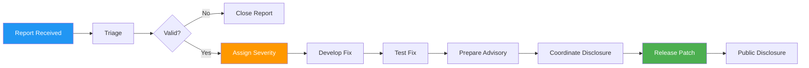

# Security Policy

## 🔒 Reporting Security Vulnerabilities

We take the security of our project seriously. If you discover a security vulnerability, please report it responsibly.

### How to Report

**DO NOT** open a public GitHub issue for security vulnerabilities.

Instead, please report security issues by:

1. **Email**: Send details to [SECURITY_CONTACT_TO_BE_DEFINED]
2. **GitHub Security Advisories**: Use the [Security Advisory](https://github.com/messier-kevin-cgi/test/security/advisories) feature

### What to Include

Please include the following information in your report:

- **Type of vulnerability** (e.g., XSS, SQL injection, authentication bypass)
- **Full paths** of source file(s) related to the vulnerability
- **Location** of the affected code (tag/branch/commit or direct URL)
- **Step-by-step instructions** to reproduce the issue
- **Proof of concept** or exploit code (if possible)
- **Impact** of the vulnerability
- **Suggested fix** (if you have one)

### Response Timeline

- **Initial Response**: Within 48 hours
- **Status Update**: Within 7 days
- **Fix Timeline**: Depends on severity, but we aim for:
  - Critical: Within 7 days
  - High: Within 30 days
  - Medium: Within 90 days
  - Low: Best effort

## 🛡️ Security Best Practices

### For Users

#### Authentication
- ✅ Use strong, unique passwords (minimum 12 characters)
- ✅ Enable two-factor authentication (2FA) where available
- ✅ Never share your credentials
- ✅ Rotate tokens and passwords regularly
- ❌ Don't store credentials in code or version control

#### API Security
- ✅ Keep your API keys secret
- ✅ Use environment variables for sensitive data
- ✅ Rotate API keys periodically
- ✅ Use HTTPS for all API calls
- ❌ Don't commit API keys to repositories
- ❌ Don't share API keys in public forums

#### Data Protection
- ✅ Keep software and dependencies up to date
- ✅ Use encrypted connections (HTTPS/TLS)
- ✅ Review permissions before granting access
- ✅ Regular backup of important data
- ❌ Don't store sensitive data in logs

### For Contributors

#### Code Security
```yaml
Do:
  - Validate all inputs
  - Use parameterized queries
  - Implement proper error handling
  - Use security headers
  - Keep dependencies updated
  - Follow OWASP guidelines
  
Don't:
  - Use eval() or similar functions
  - Trust user input
  - Expose sensitive information in errors
  - Hard-code credentials
  - Use deprecated or insecure libraries
```

#### Dependency Management
- ✅ Keep dependencies up to date
- ✅ Use tools like Dependabot
- ✅ Review dependency security advisories
- ✅ Use lock files (package-lock.json, yarn.lock, etc.)
- ✅ Audit dependencies regularly (`npm audit`, `pip-audit`, etc.)

#### Git Security
- ✅ Sign commits with GPG
- ✅ Use branch protection rules
- ✅ Enable two-factor authentication on GitHub
- ✅ Review what you commit
- ❌ Never commit secrets, keys, or passwords
- ❌ Don't use personal access tokens in scripts

## 🔍 Security Measures Implemented

> ⚠️ **Note**: Security measures to be implemented as the project develops.

### Planned Security Features

#### Authentication & Authorization
- [ ] JWT-based authentication
- [ ] Role-based access control (RBAC)
- [ ] OAuth 2.0 integration
- [ ] Two-factor authentication (2FA)
- [ ] Session management
- [ ] Password hashing (bcrypt/argon2)

#### Data Protection
- [ ] Encryption at rest
- [ ] Encryption in transit (TLS 1.3)
- [ ] Database encryption
- [ ] Secure backup procedures
- [ ] Data anonymization for logs

#### Infrastructure Security
- [ ] Firewall configuration
- [ ] DDoS protection
- [ ] Intrusion detection system (IDS)
- [ ] Security monitoring
- [ ] Regular security audits
- [ ] Penetration testing

#### Application Security
- [ ] Input validation and sanitization
- [ ] Output encoding
- [ ] CSRF protection
- [ ] XSS protection
- [ ] SQL injection prevention
- [ ] Rate limiting
- [ ] Security headers (CSP, HSTS, etc.)

## 🛠️ Security Tools & Scanning

### Automated Security Checks

#### GitHub Security Features
- [x] Dependabot alerts
- [ ] Code scanning (CodeQL)
- [ ] Secret scanning
- [ ] Security advisories

#### Recommended Tools

```bash
# Dependency scanning
npm audit                    # Node.js
pip-audit                    # Python
mvn dependency-check:check   # Java

# Code scanning
semgrep                      # Multi-language
bandit                       # Python
eslint-plugin-security       # JavaScript

# Secret scanning
truffleHog
git-secrets
detect-secrets

# Container scanning
trivy
snyk container
```

### CI/CD Security

```yaml
# Example GitHub Actions workflow
name: Security Scan

on: [push, pull_request]

jobs:
  security:
    runs-on: ubuntu-latest
    steps:
      - uses: actions/checkout@v3
      
      - name: Run dependency check
        run: npm audit
        
      - name: Run CodeQL
        uses: github/codeql-action/analyze@v2
        
      - name: Run container scan
        uses: aquasecurity/trivy-action@master
```

## 🔐 Security Configuration Checklist

### Application Level

```markdown
- [ ] All inputs are validated and sanitized
- [ ] All outputs are properly encoded
- [ ] SQL queries use parameterized statements
- [ ] Passwords are hashed with strong algorithms
- [ ] Sensitive data is encrypted
- [ ] Security headers are implemented
- [ ] CORS is properly configured
- [ ] Rate limiting is in place
- [ ] Error messages don't expose sensitive info
- [ ] Logging doesn't include sensitive data
```

### Infrastructure Level

```markdown
- [ ] HTTPS/TLS is enforced
- [ ] Firewall rules are configured
- [ ] Unnecessary ports are closed
- [ ] Regular backups are scheduled
- [ ] Monitoring and alerting are active
- [ ] Access logs are maintained
- [ ] Intrusion detection is enabled
- [ ] Security patches are applied promptly
```

### Development Level

```markdown
- [ ] Code reviews include security checks
- [ ] Secrets are not committed to version control
- [ ] Environment variables are used for config
- [ ] Dependencies are regularly updated
- [ ] Security testing is automated
- [ ] Documentation is kept current
```

## 📚 Security Resources

### OWASP Resources
- [OWASP Top 10](https://owasp.org/www-project-top-ten/)
- [OWASP Cheat Sheet Series](https://cheatsheetseries.owasp.org/)
- [OWASP API Security Project](https://owasp.org/www-project-api-security/)

### Security Guidelines
- [CWE Top 25](https://cwe.mitre.org/top25/)
- [SANS Top 25](https://www.sans.org/top25-software-errors/)
- [NIST Cybersecurity Framework](https://www.nist.gov/cyberframework)

### Secure Coding Guides
- [Node.js Security Best Practices](https://nodejs.org/en/docs/guides/security/)
- [Python Security](https://python.readthedocs.io/en/latest/library/security.html)
- [Java Secure Coding Guidelines](https://www.oracle.com/java/technologies/javase/seccodeguide.html)

## 🎓 Security Training

### Recommended Learning
- [OWASP WebGoat](https://owasp.org/www-project-webgoat/)
- [PortSwigger Web Security Academy](https://portswigger.net/web-security)
- [HackerOne](https://www.hackerone.com/resources)

## 📋 Vulnerability Disclosure Timeline

When a vulnerability is reported and confirmed:

1. **Day 0**: Vulnerability reported
2. **Day 1-2**: Initial response and confirmation
3. **Day 3-7**: Investigation and patch development
4. **Day 7-14**: Testing and validation
5. **Day 14-21**: Coordinated disclosure preparation
6. **Day 21+**: Public disclosure and patch release

### Disclosure Process



## 🏆 Security Hall of Fame

We appreciate security researchers who responsibly disclose vulnerabilities. Contributors will be recognized here (with permission):

> No vulnerabilities reported yet.

## ⚠️ Known Security Limitations

> ⚠️ **Missing Information**: To be documented as system is developed.

Current limitations:
- System is in development; security features not fully implemented
- Regular security audits not yet established
- Penetration testing not yet conducted

## 📞 Contact

**Security Contact**: [TO BE DEFINED]

For non-security issues, please use:
- GitHub Issues: https://github.com/messier-kevin-cgi/test/issues
- General Contact: https://github.com/messier-kevin-cgi

---

## 📄 Policy Information

- **Policy Version**: 1.0
- **Last Updated**: 2024
- **Next Review**: TBD
- **Status**: 🟡 Template - To be reviewed and finalized

---

**Remember**: Security is everyone's responsibility. When in doubt, ask! 🔒