# Architecture Documentation

## 📋 Table of Contents

- [Overview](#overview)
- [System Architecture](#system-architecture)
- [Component Design](#component-design)
- [Data Architecture](#data-architecture)
- [Security Architecture](#security-architecture)
- [Deployment Architecture](#deployment-architecture)
- [Technology Stack](#technology-stack)
- [Design Patterns](#design-patterns)
- [Scalability Considerations](#scalability-considerations)

## 🎯 Overview

> ⚠️ **Note**: This document represents a template for architectural documentation. Specific implementation details will be added as the project evolves.

This document describes the architectural design decisions, patterns, and principles used in the Test repository project.

### Architecture Goals

- **Scalability**: Support growing user base and data volume
- **Maintainability**: Easy to understand, modify, and extend
- **Reliability**: High availability and fault tolerance
- **Security**: Protection against common vulnerabilities
- **Performance**: Fast response times and efficient resource usage
- **Flexibility**: Adaptable to changing requirements

## 🏗️ System Architecture

### High-Level Overview

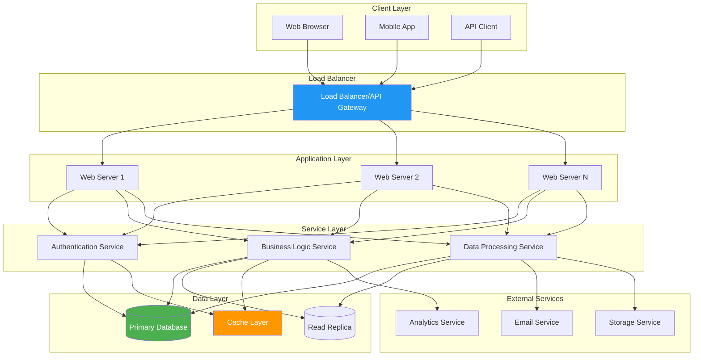

### Architectural Layers

#### 1. Presentation Layer
- User interface components
- Client-side logic
- API consumption
- State management

#### 2. Application Layer
- HTTP request handling
- Routing
- Middleware processing
- Session management
- Input validation

#### 3. Business Logic Layer
- Domain logic implementation
- Business rules enforcement
- Data transformation
- Process orchestration

#### 4. Data Access Layer
- Database queries
- ORM operations
- Cache management
- Data validation

#### 5. Infrastructure Layer
- Logging
- Monitoring
- Configuration management
- External service integration

## 🔧 Component Design

### Component Interaction

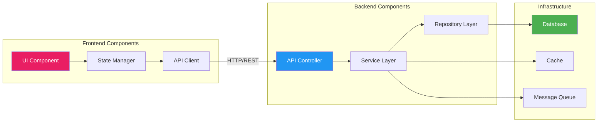

### Core Components

> ⚠️ **Missing Information**: Component specifications to be defined based on chosen technology stack.

#### API Gateway
- **Purpose**: Entry point for all client requests
- **Responsibilities**:
  - Request routing
  - Rate limiting
  - Authentication
  - Load balancing
  - Request/response transformation

#### Authentication Service
- **Purpose**: Handle user authentication and authorization
- **Responsibilities**:
  - User login/logout
  - Token generation/validation
  - Permission management
  - Session handling

#### Business Logic Service
- **Purpose**: Core application functionality
- **Responsibilities**:
  - Business rules implementation
  - Data processing
  - Workflow management
  - Integration coordination

#### Data Access Service
- **Purpose**: Database operations abstraction
- **Responsibilities**:
  - CRUD operations
  - Query optimization
  - Transaction management
  - Data validation

### Component Communication

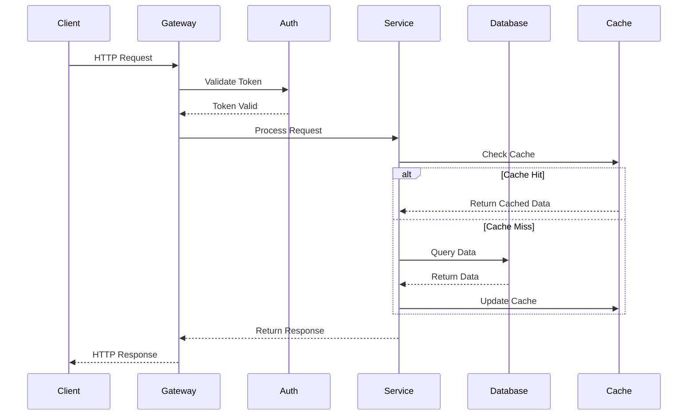

## 💾 Data Architecture

### Data Model

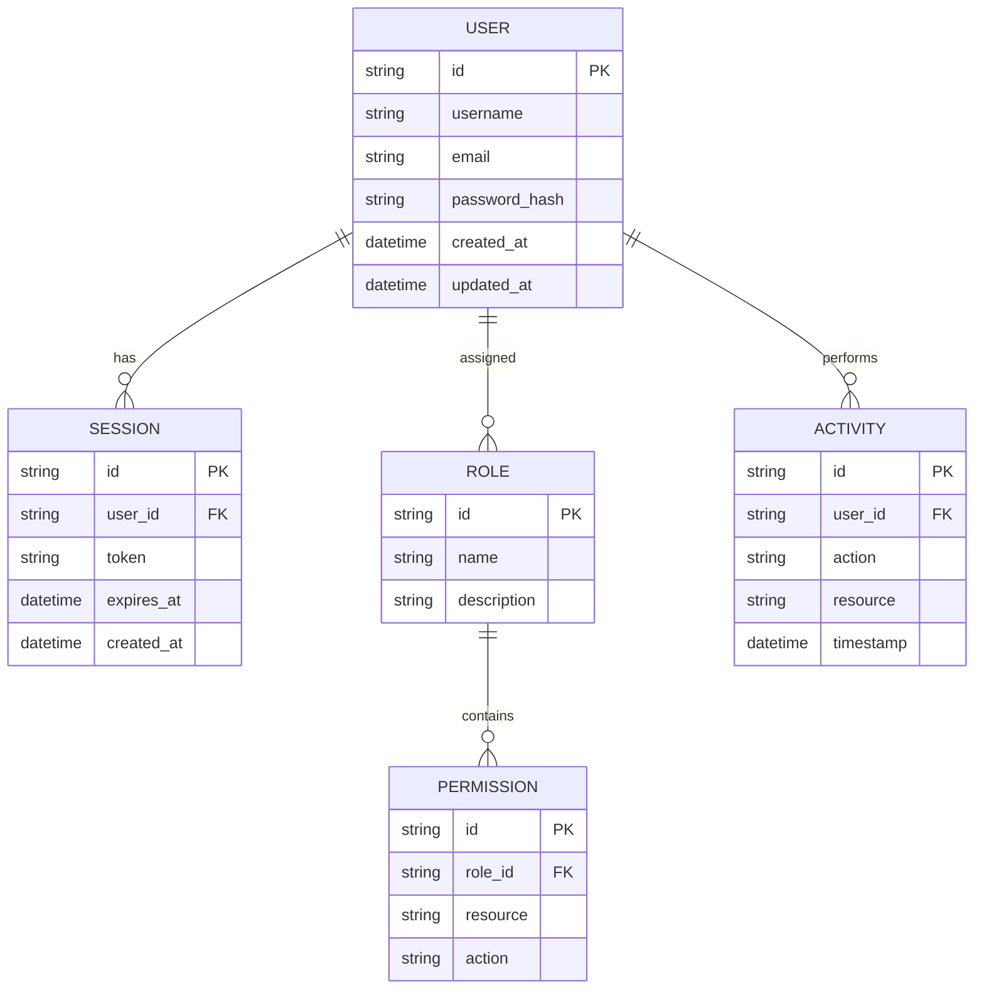

> ⚠️ **Missing Information**: Actual database schema to be defined based on application requirements.

### Data Flow

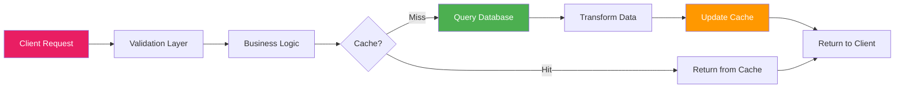

### Data Storage Strategy

| Data Type | Storage | Rationale |
|-----------|---------|-----------|
| User Data | Primary DB | ACID compliance required |
| Session Data | Cache/Redis | Fast access, temporary |
| Files/Media | Object Storage | Scalability, CDN integration |
| Logs | Log Aggregator | Centralized monitoring |
| Analytics | Analytics DB | Optimized for queries |
| Backups | Cold Storage | Cost-effective archival |

## 🔒 Security Architecture

### Security Layers

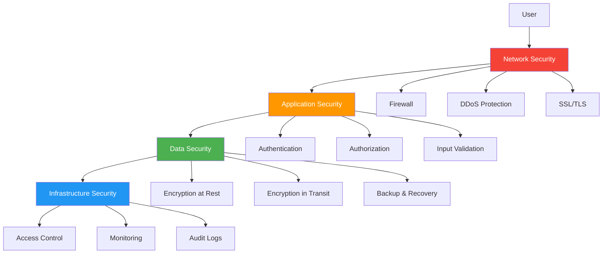

### Authentication & Authorization Flow

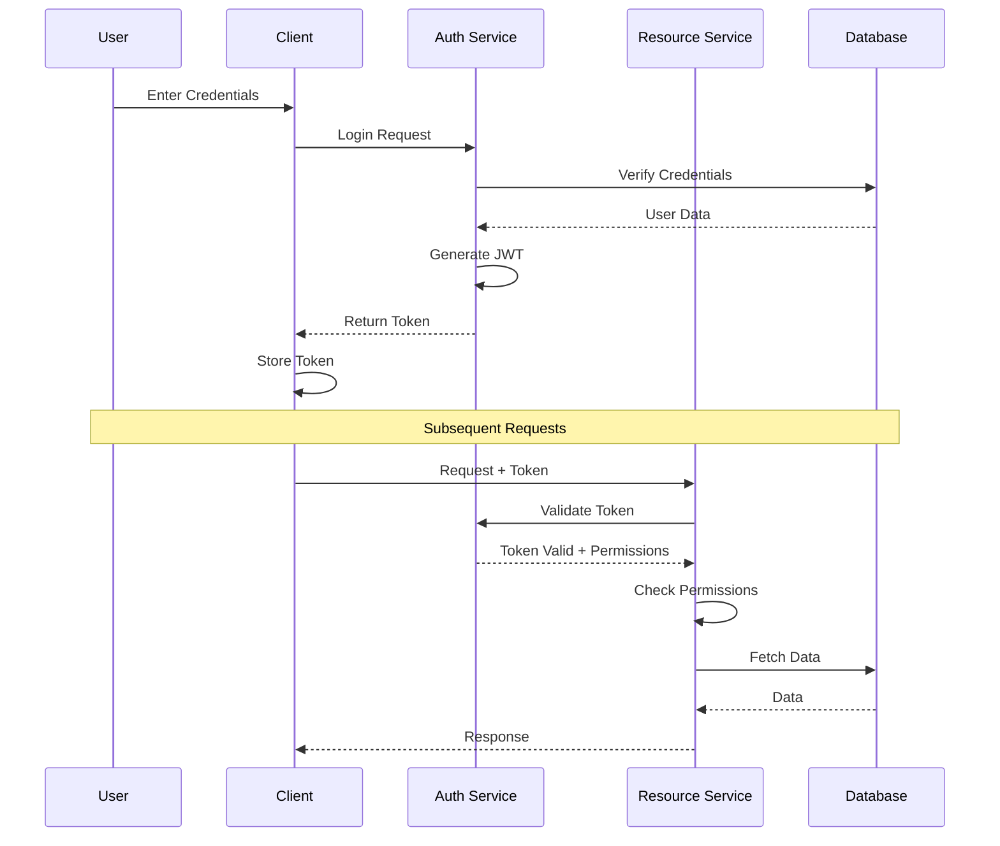

### Security Best Practices

- ✅ Use HTTPS everywhere
- ✅ Implement JWT with expiration
- ✅ Hash passwords with bcrypt/argon2
- ✅ Sanitize all inputs
- ✅ Use parameterized queries
- ✅ Implement rate limiting
- ✅ Enable CORS properly
- ✅ Use security headers
- ✅ Regular security audits
- ✅ Dependency vulnerability scanning

## 🚀 Deployment Architecture

### Deployment Pipeline

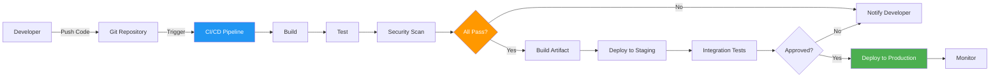

### Infrastructure Diagram

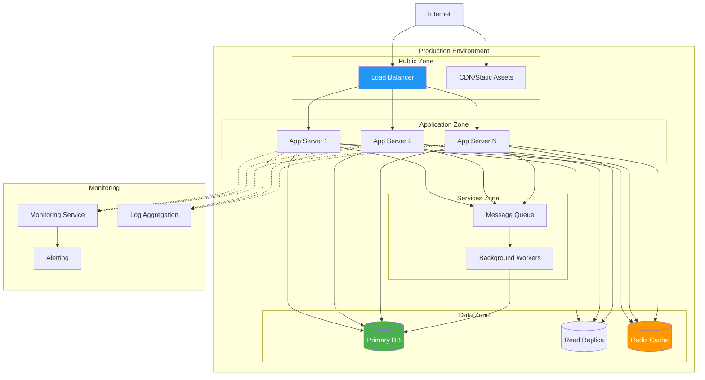

### Environment Strategy

| Environment | Purpose | Deployment |
|-------------|---------|------------|
| Development | Local development | Manual |
| Staging | Pre-production testing | Automatic on merge |
| Production | Live system | Manual approval |

## 🛠️ Technology Stack

> ⚠️ **Missing Information**: Technology stack not yet defined. Below are recommendations.

### Recommended Stack Options

#### Option 1: JavaScript/Node.js Stack
```yaml
Frontend:
  - Framework: React/Vue/Angular
  - State Management: Redux/Vuex/NgRx
  - Build Tool: Vite/Webpack
  
Backend:
  - Runtime: Node.js
  - Framework: Express/NestJS/Fastify
  - ORM: Prisma/TypeORM
  
Database:
  - Primary: PostgreSQL
  - Cache: Redis
  - Search: Elasticsearch
  
Infrastructure:
  - Containerization: Docker
  - Orchestration: Kubernetes
  - CI/CD: GitHub Actions
  - Cloud: AWS/GCP/Azure
```

#### Option 2: Python Stack
```yaml
Frontend:
  - Framework: React/Vue
  - Build Tool: Vite
  
Backend:
  - Framework: FastAPI/Django/Flask
  - ORM: SQLAlchemy/Django ORM
  
Database:
  - Primary: PostgreSQL
  - Cache: Redis
  - Search: Elasticsearch
  
Infrastructure:
  - Containerization: Docker
  - Orchestration: Kubernetes
  - CI/CD: GitHub Actions
  - Cloud: AWS/GCP/Azure
```

## 🎨 Design Patterns

### Architectural Patterns

#### 1. Layered Architecture
Separation of concerns across distinct layers.

#### 2. Repository Pattern
Abstraction of data access logic.

```javascript
class UserRepository {
  async findById(id) {
    return await this.db.users.findUnique({ where: { id } });
  }
  
  async create(userData) {
    return await this.db.users.create({ data: userData });
  }
  
  async update(id, userData) {
    return await this.db.users.update({ where: { id }, data: userData });
  }
}
```

#### 3. Service Pattern
Business logic encapsulation.

```javascript
class UserService {
  constructor(userRepository, emailService) {
    this.userRepo = userRepository;
    this.emailService = emailService;
  }
  
  async registerUser(userData) {
    const user = await this.userRepo.create(userData);
    await this.emailService.sendWelcomeEmail(user.email);
    return user;
  }
}
```

#### 4. Factory Pattern
Object creation abstraction.

#### 5. Singleton Pattern
Single instance management for services.

#### 6. Dependency Injection
Loose coupling and testability.

### API Design Pattern

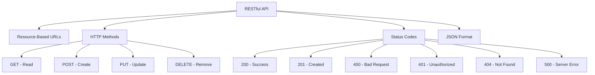

## 📈 Scalability Considerations

### Horizontal Scaling

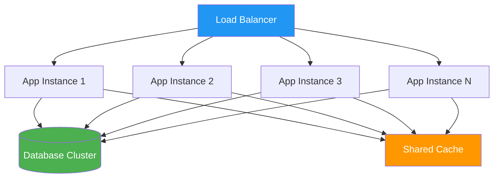

### Scaling Strategies

1. **Database Scaling**
   - Read replicas for read-heavy workloads
   - Sharding for data partitioning
   - Connection pooling

2. **Application Scaling**
   - Stateless application servers
   - Load balancing
   - Auto-scaling based on metrics

3. **Caching Strategy**
   - In-memory caching (Redis)
   - CDN for static assets
   - Query result caching

4. **Asynchronous Processing**
   - Message queues for background jobs
   - Event-driven architecture
   - Worker processes

### Performance Optimization

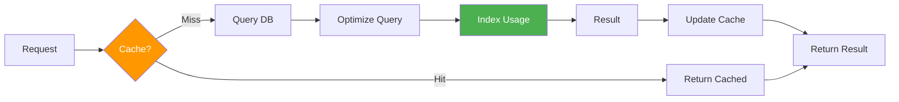

## 🔍 Monitoring & Observability

### Monitoring Stack

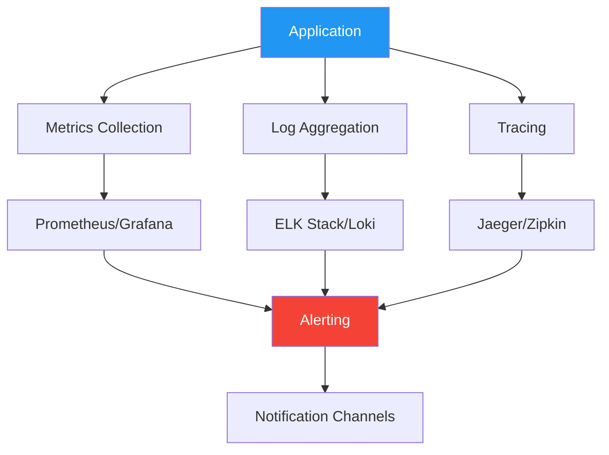

### Key Metrics

- **Application Metrics**: Response time, throughput, error rate
- **Infrastructure Metrics**: CPU, memory, disk, network
- **Business Metrics**: User activity, conversion rates
- **Database Metrics**: Query time, connection pool usage

---

## 📚 References

- [The Twelve-Factor App](https://12factor.net/)
- [Microservices Patterns](https://microservices.io/)
- [OWASP Security Guidelines](https://owasp.org/)
- [REST API Design](https://restfulapi.net/)

---

**Document Version**: 1.0  
**Last Updated**: 2024  
**Status**: 🟡 Template - To be updated with implementation details